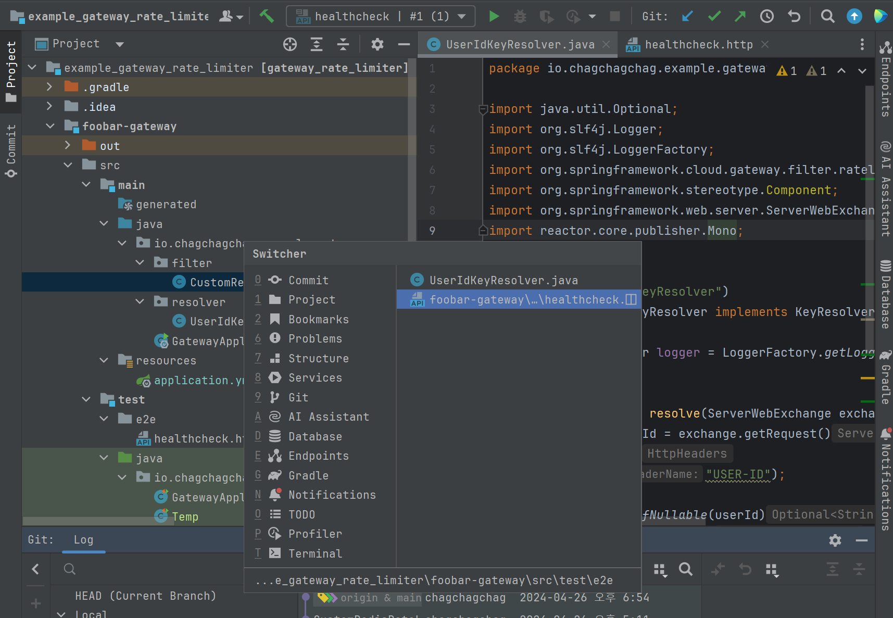

## 1. IDE 메뉴 

리눅스에는 Cmd 키가 없기에 리눅스, 윈도우의 키보드를 기준으로 단축키를 정리합니다. 그리고 맥 OS 에서의 단축키 역시 부가적으로 추가했습니다. 

## 윈도우 전환

### Project 윈도우 포커스

- Alt + 1
- Cmd + 1

Alt + 1 을 누르면 Project 윈도우로 포커스를 이동할 수 있습니다.

 

### Editor 윈도우 포커스

- ESC

ESC 키를 누르면 Editor 윈도우로 돌아올 수 있습니다.

 

### Project 윈도우 내의 파일 미리보기

- Space

Project 윈도우 내의 파일에 커서가 위치한 채로, Space 키를 누르면 그 파일의 내용을 미리보기 가능합니다.

 

### Editor 윈도우 확대 (전체화면 전환)

- Ctrl + Shfit + F12
- Cmd + Shift + F12

Ctrl + Shift + F12 를 누르면 현재 포커스가 있는 Editor 윈도우를 전체화면으로 전환 가능합니다.

 

### Editor 윈도우 또는 다른 메뉴 들 간 전환

- Ctrl + tab

 

### 최근 파일 열기

- Cmd + E
- Ctrl + E

최근에 열었던 파일을 열기 위해서는 Ctrl + E (리눅스, 윈도우) 또는 Cmd + E 를 사용하면 됩니다.

 

## 검색, 최근파일

### 사용된 위치 찾기

#### 일반 검색

- Alt + F7
- Opt + F7

아래 그림에서는 `UserIdKeyResolver` 가 사용된 곳들을 찾기 위해 `UserIdKeyResolver` 에 커서를 올려둔 후  `Alt + F7` 을 눌렀습니다. UserIdKeyResolver 가 사용된 다양한 파일들이 보인다는 것을 확인 가능합니다.

 

#### 간소화된 일반 검색

- Ctrl + B
- Cmd + B

UserIdKeyResolver 에 커서를 올려둔 후 `Ctrl + B` 버튼을 눌렀습니다. 사용처들이 팝업으로 나타납니다.

 

### 파일 내에서 단어 검색, 이동

- 검색 : Ctrl + F (리눅스, 윈도우), Cmd + F (Mac)
- 검색 결과에서 Next 이동, Prev 이동
  - Next : F3 (리눅스, 윈도우), Cmd + G (Mac)
  - Prev : Shift + F3(리눅스, 윈도우) , Cmd + Shift + G (Mac)

파일 내에서 특정 단어를 검색할 때는 Ctrl + F 또는 Cmd + F 를 사용합니다. 검색한 결과가 여러개일때 F3 또는 Cmd + G 키를 누르면 Next 로 이동이 가능하고, Shift + F3 또는 Cmd + Shift + G 를 누르면 Prev 로 이동이 가능합니다.

 

### 단어 전체 검색 (1)

- Ctrl + Shift + F
- Cmd + Shift + F

특정 단어를 전체 검색하려고 할 경우 Project, Directory, Scope 단위 내에서 원하는 단어를 검색가능합니다.

 

### 단어 전체 검색 (2) : Magic Search

- Shift 두번 탭

Shift 를 두번 누르면 Classes 별로 검색, File 별로 검색, Symobl 별로 검색, Actions 별 검색, Git 에서 검색, Text 검색을 종류별로 수행 가능합니다.

