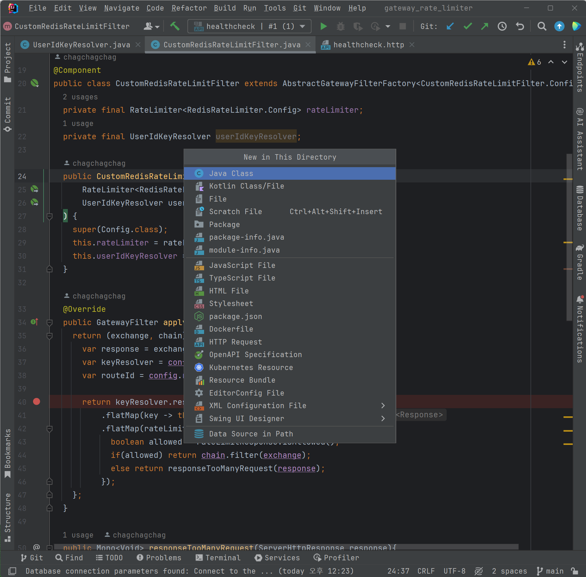
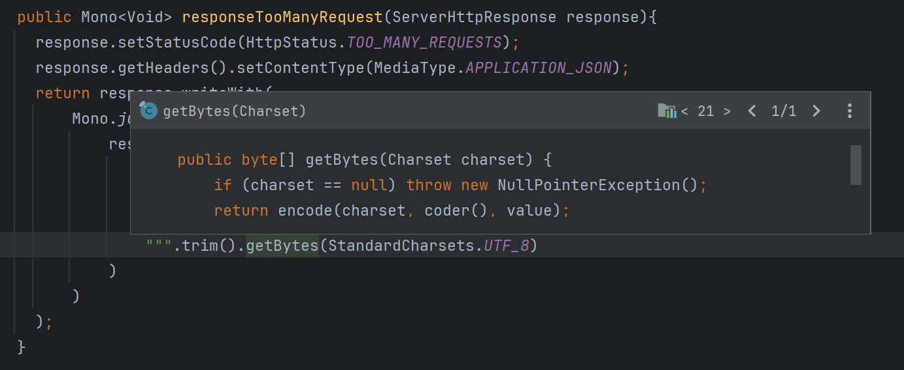
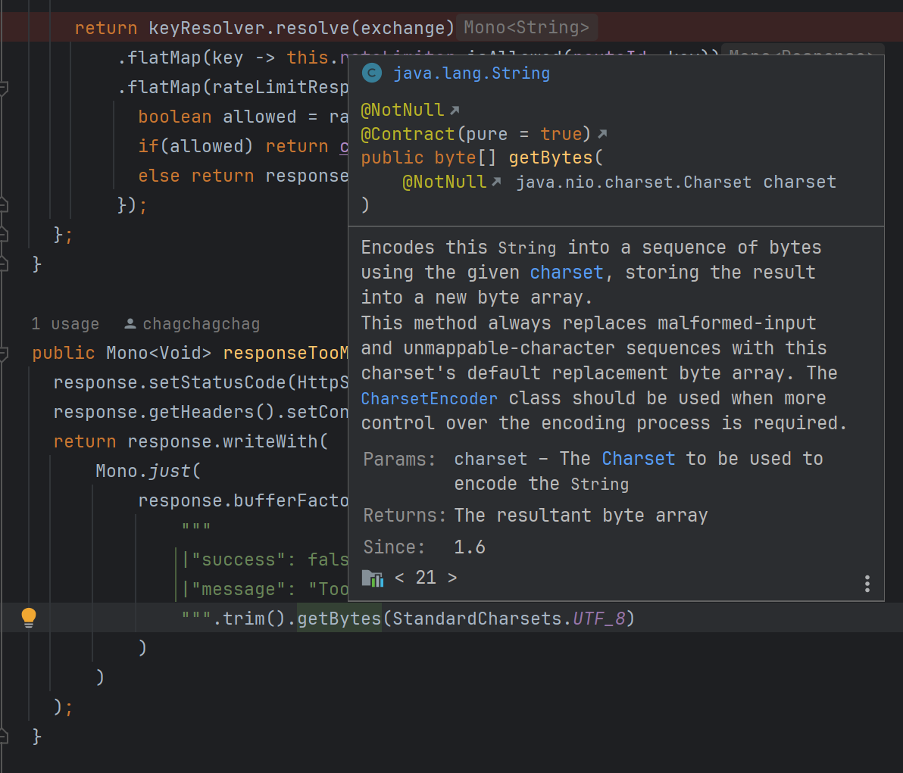
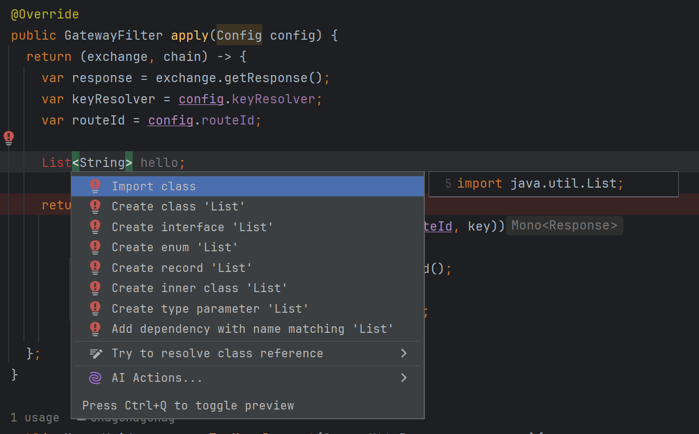

## 2. 에디터 메뉴

### 새 파일 생성

Project Window 에서 생성할 때

- Alt + Insert
- Cmd + N

Editor 에서 생성할 때 

- Ctrl + Alt + Insert
- Ctrl + Opt + N

Editor 에서 파일을 생성하려 한다면 Ctrl + Alt + Insert 또는 Ctrl + Opt + N 을 단축키로 사용합니다.

 

### Generate (코드 Generate)

- Alt + Insert
- Cmd + N

 

### Override, Implements

Override 

- Ctrl + O

implements

- Ctrl + i

 

### 파라미터 정보 Tooltip 띄우기

- Ctrl + P
- Cmd + P

 

### Quick Definition (코드 Definition 확인)

- Ctrl + Shift + i
- Ctrl + Space (Mac)

 

### Quick Document (Document 확인)

- Linux, Window : Ctrl + Q
- Mac : F1

 

### Syntax 자동완성

- Shft + Ctrl + Enter
- Shift + Cmd + Enter

 

### 커서 이동

단어별 이동 

- Ctrl + → , Ctrl + ←
- Opt + → , Opt + ← 

라인 시작, 끝 이동 (Home, End)

- 리눅스, 윈도우에는 있는 키이지만, Mac 에서는 난감한 경우가 많습니다.

- Home, End
- fn + ← , fn + →

페이지 위,아래 이동

- page up, page down
- fn + ↑, fn + ↓

 

### 선택 영역 확장/축소

확장

- Ctrl + W
- Opt + ↑

축소

- Ctrl + Shift + W
- Opt + ↓

 

### 주석 처리

한줄 주석 

- Ctrl + /
- Cmd + /

블록 주석

- Cmd + Opt + /
- Shift + Ctrl + /

 

### Tab Indentation

Tab 키를 이용해서 Indentation 하는 것을 의미합니다. 

오른쪽으로 Indentation

- Tab

왼쪽으로 Indentation

- Shift + Tab

 

### 자동 인덴트

자동 인덴테이션을 의미합니다.

- Ctrl + Alt + i
- Ctrl + Opt + i

 

### 라인 복제/삭제

라인 복제

- Ctrl + D
- Cmd + D

라인 삭제

- Ctrl + Y
- Cmd + `Del` 키

 

### Live Template

예를 들어 psvm, sout 과 같은 Live Template 을 빠르게 적용하려고 할 경우에는 아래의 단축키를 사용해도 됩니다. 굳이 아래의 키를 입력하지 않아도 타이핑 시에 Live Template 탐색이 진행되긴 합니다.

- Ctrl + J
- Cmd + J

 

### Quick fix

- Alt + Enter
- Cmd + Enter

 

### 코드 이슈별 이동

- F2, Shift + F2

 

### Optimize Import

- Ctrl + Alt + O
- Ctrl + Opt + O

 

### Action 검색

- Shift + Ctrl + A
- Shift + Cmd + A

 

