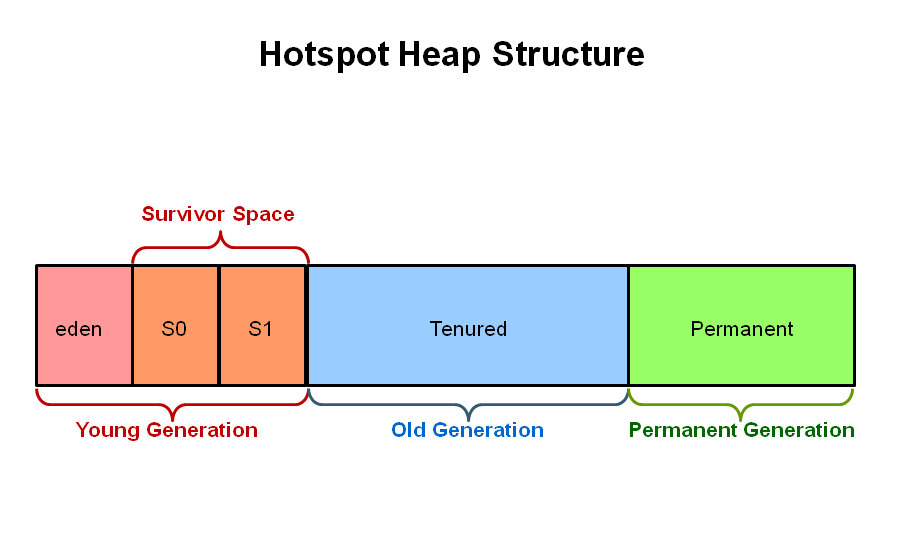
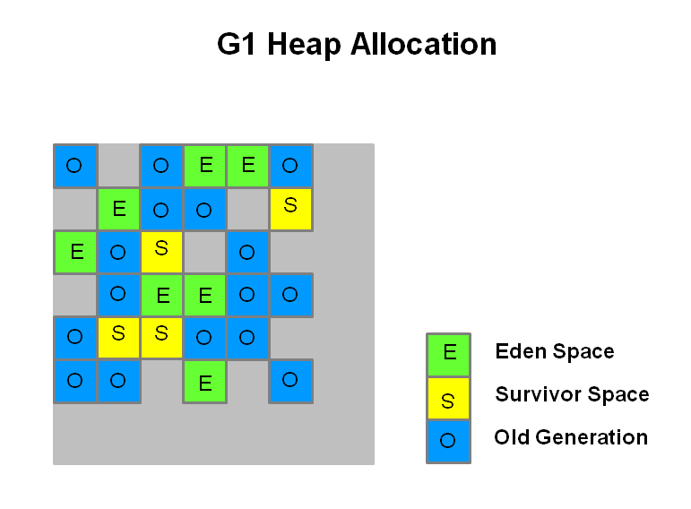

## 가비지 컬렉터란?

### 참고자료

- [Oracle.com - Getting Started With the G1 Garbage Collector](https://www.oracle.com/technetwork/tutorials/tutorials-1876574.html)
- [JVM 아키텍처](https://starkying.tistory.com/entry/JVM-아키텍처와-Garbage-Collection-기초-요약?category=689625)
- [Java Constant Pool](https://starkying.tistory.com/entry/what-is-java-string-pool)

 

### 가비지(Garbage)란?

Oracle 의 Java SE 8 GC 튜닝 가이드에서는 가비지를 아래와 같이 이야기하고 있습니다.

> An object is considered garbage when it can no longer be reached from any pointer in the running program.
>
> - 실행 중인 프로그램에서 더 이상 어떤 포인터로도 접근이 불가능한 객체를 가비지(Garbage)로 간주합니다.

즉, 더 이상 참조되고 있지 않은 객체는 광활한 힙 안에서 참조하는 변수 없이 혼자 있습니다. 이런 객체를 가비지(Garbage)라고 부릅니다.

 

### 가비지 컬렉터

- 힙 메모리에서 사용되지 않는 영역의 객체들을 탐색해서 제거하는 역할을 수행합니다.
- GC가 수행되는 동안에는 아무것도 못한다. 정확히 예측하기 쉽지 않습니다.
- GC가 수행되는 동안 GC를 수행하는 스레드를 제외한 모든 스레드가 정지됩니다.
- Full GC가 일어나서 몇초간 스레드가 정지하게 되면 장애로 이어지는 치명적인 문제가 발생할 수 있습니다. (Stop the world)

 

### 가비지 컬렉터의 종류

대표적인 가비지 컬렉터 들의 종류는 아래와 같습니다.

- Serial Collector
- Parallel Collector
- Concurrenct Collector
  - Concurrent Mark Sweep (CMS) Collector
  - Garbage First Gabage Collector

 

### 가비지 컬렉터의 세대의 전환과정

> 참고자료 : [Oracle.com - Getting Started With the G1 Garbage Collector](https://www.oracle.com/technetwork/tutorials/tutorials-1876574.html) / ‘The G1 Garbage Collector’ 

오래된 버전의 Garbage Collector 들은 Heap 을 3개의 영역으로 분류합니다.

- Young Generation
- Old Generation
- Permanent Generation

 

 

하지만 G1 Collector가 도입되면서 조금은 다른 접근방법을 택했습니다. 아래와 같은 방식입니다.  

위와 같은 하나의 영역을 Region 이라고 부릅니다. 그리고 이 Region을 여러 단위로 해서 힙을 나누어 가비지 컬렉팅을 수행합니다. 

> 더 자세한 내용은 [Oracle.com - Getting Started With the G1 Garbage Collector](https://www.oracle.com/technetwork/tutorials/tutorials-1876574.html) 을 참고

 

### Garbage-First Garbage Collector (G1GC)

다른 가비지 컬렉터 들에 비해 비교적 제일 나중에(최근에) 개발된 가비지 컬렉터 입니다.

다국적 서비스 기업들이 많이 태동하면서 가비지 컬렉터 역시 패러다임의 전환이 이뤄졌는데, G1GC에 이런 내용들이 반영되어 많은 부분이 변화했습니다. 흔히 G1GC 라고 불리는 가비지 컬렉터입니다. G1GC는 서버 스타일의 컬렉터입니다. G1GC 는 Generational GC가 아닙니다. (G1GC는 Generation 구분을 따로 하지 않는다.)

- 큰 메모리를 가진 멀티 프로세서 머신에 적합한 가비지컬렉터
- Young Generation 영역 : Snapshot-At-The-Beginning 알고리즘을 사용
- Old Generation 영역 : Snapshot-At-The-Beginning 알고리즘을 사용
- JVM 옵션 : `-XX:+UseG1GC` : G1 컬렉터를 활성화

 

### Serial Collector

- 싱글 스레드 기반의 가비지 컬렉터
- 싱글 스레드 기반이기에 싱글 프로세서 시스템에 적합
- 멀티코어를 사용할 수 없다는 점이 단점
- Young Generation 영역 : Serial 알고리즘을 사용
- Old Generation 영역 : Serial Mark-Sweep-Compact 알고리즘을 사용
- JVM 옵션 : -XX+UseSerialGC

 

### Parallel Collector

Parallel Compaction 을 사용하면 Major GC 를 병렬로 수행합니다.

- 마이너 GC를 병렬로 수행
- 메이저 GC는 Parallel Compaction 을 사용할 경우에만 병렬로 수행
- 멀티프로세서, 멀티 스레드 하드웨어에서 중대형 규모 애플리케이션에 적합한 GC
- JVM 옵션
- `-XX:+UseParallelGC` : Parallel Compaction 을 디폴트로 사용하는 옵션
- `-XX:-UseParallelOldGC` : Parallel Compaction 을 사용하지 않도록 명시하는 옵션

 

### Concurrent Collector

전체 처리율 보다 응답 시간이 더 중요할 경우에 사용합니다.

- 프로세서가 GC와 처리 역할을 나누어 일을 하기에 일시 정지가 짧아집니다.
- 프로세서의 수를 늘릴수록 효과를 볼 수 있지만 한계가 있습니다.
- Concurrent Collector 는 아래의 두가지가 있습니다.
  - Concurrent Mark Sweep(CMS) Collector
  - Garbage-First Garbage Collector (G1GC)

 

### Concurrent Mark Sweep(CMS) Collector

가비지 컬렉션의 일시정지가 짧은 것이 선호되는 애플리케이션에 사용되면 좋은 컬렉터입니다.

- 프로세서의 리소스를 가비지 컬렉션과 공유합니다.(프로세서가 가진 자원들을 가비지컬렉션과 공유)
- Heap 메모리 영역의 크기가 클 때 적합한 Collector
- GC의 일시 정지 시간을 줄이는 것이 목적입니다. 크기가 큰 오래된 객체가 있는 경우에 적합합니다.
- JVM 옵션 :
  - `-XX:+UseConcMarkSweepGC` : CMS 컬렉터를 enable 하는 옵션
- Young Generation 영역: Parallel GC 알고리즘
- Old Generation 영역 : **Concurrent Mark Sweep GC 알고리즘** 사용
  - Concurrent Mark Sweep GC 알고리즘에 대해서는 이 문서 하단에 별도로 설명을 정리해두었습니다.

 

