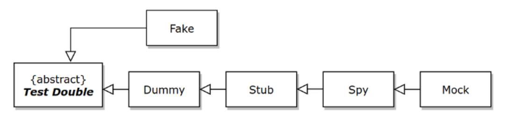

## Stub, Spy, Mock vs Dummy, Fake

## Fake 객체, 대역, Stub 이란?

테스트 코드 작성시 실제 객체가 아닌 단순한 객체를 이용해 어떤 동작을 하게끔 해서 결과값이나 동작을 테스트 하는 경우가 많습니다. 이런 경우 Fake 객체를 사용하거나 대역을 수행하는 객체를 도입하게 됩니다. Fake 객체와 대역 객체의 차이는 아래와 같습니다. 대역이라는 것은 드라마에서 이야기하는 `대역` 과 같은 의미입니다. 

- Fake 객체
  - 어떤 하나의 동작을 수행하는 하나의 클래스를 테스트용도로 정의해서 사용하는 것을 의미한다.
- 대역 = stub
  - `이런 이런 조건에서는 이렇게 대답한다` 라는 대사를 기억하는 **대역**을 수행하는 도입하는데, 이것을 실제 하나의 타입으로 정의해서 테스트를 만드는 경우도 있고 Mockito 와 같은 프레임워크를 통해 하나의 표현식으로 만들어서 테스트를 만드는 경우도 있습니다.
  - 대역이 하는 **대사** 를 stub 이라고 이야기합니다.

 

## 테스트 더블이란?

- 가짜 객체 또는 대역 객체를 이용해 테스트하는 것을 `Test Double` 이라고 부릅니다.
- 제라드 메스자로스(Gerard Meszaros)가 만든 용어입니다.

 

## 요약해보면... 

- `Stub` : Stub 은 가짜 객체로 정의한 Mock, Dummy, Fake 객체가 수행하는 `대사` 를 의미합니다. 
  - 쉽게 설명하면 Mock, Dummy, Fake 객체의 특정 메서드가 어떤 입력값을 받았을 때 어떤 값을 반환할 지 등을 정의하는 것을 `Stubbing`, `Stub` 이라고 이야기합니다.
- `Stub 클래스` : 그런데 이 Stub 은 클래스로도 따로 정의할 수 있습니다. 실제 테스트하려는 클래스를 상속(확장)한 자식(확장)클래스 내에서 테스트를 원하는 메서드를 오버라이딩하는 방식으로 흔히 Stub 클래스를 정의합니다.

 

## Mock, Dummy, Fake

이번에는 Mock 이라고 부르는 객체를 알아봅니다.

- `Mock, Dummy, Fake` : Mock, Dummy, Fake 는 테스트를 위한 객체를 만드는 것을 의미합니다. 

**Mock과 Stub은 뭐가 다른건가요?** 

Mock 은 Stub을 하기 위해 사용하는 가짜 객체를 의미하는데, Mock 객체를 기반으로 Stub을 하는 것은 꽤 흔하게 자주 사용되는 편 입니다.  

Stub 은 하나의 실제 행위를 테스트 하기 위해 실제 객체를 대체하면서 **어떻게 연기할지** 를 정의하는 것을 의미합니다.  

즉 Stub은 대역이 하는 대사를 의미합니다. 따라서 Mock 객체로 Stub 을 한다는 것은 Mock 객체로 어떤 연기를 한다는 것을 의미합니다. 

이렇게 Stub을 수행하는 객체는 Mock 기반의 가짜객체를 사용할 수도 있겠지만 `Stub-` 이라는 접두사를 붙인 하나의 클래스/타입으로 만들어서 테스트 상황(요건)을 정형화해두는 것도 좋은 테스트 방식 중 하나입니다. 

> `Stub-` 클래스를 정의한다는 것은 테스트 상황/전제조건을 클래스로 직접 정의해둔 것이고 Mock 기반의 가정구문을 작성한 것은 테스트 상황/전제조건을 표현식 기반으로 작성한다는 것을 의미합니다. 
>  

- Stub 클래스
  - Dummy 데이터 기반으로 동작하게 만든 객체
  - Stub 을 테스트 코드에서 사용하는 방식은 **클래스 기반의 Stub**, **가짜 객체 기반의 Stub 표현식**이 있습니다.
  - **클래스 기반의 Stub, 가짜 객체 기반의 Stub 표현식**은 글의 아래에 별도로 정리해두었습니다.
  - 주로 실제 클래스를 상속받은 후 테스트하려는 메서드를 오버라이딩 하기도 합니다.
- Mock
  - 가짜 객체를 만드는 것을 의미합니다.
  - 가짜 객체를 만들어서 표현식 기반으로 Stub 하는 것 역시 가능합니다. 
  - 예를 들면 Mockito 프레임워크를 사용해서 Stub을 하면, Stub을 표현식 기반으로 하는 것이 됩니다.
  - 테스트 케이스가 비즈니스 적으로 확립된 요건이라면 여기 저기 산발되는 테스트 코드의 재사용성을 위해 `Stub-` 클래스를 정의해두기도 합니다. 
    - (개별 테스트 요건/전제조건을 일일이 개별 테스트 클래스를 찾아서 Mockito 구문을 확인하는 것이 비생산적인 작업이 될수 있는 순간이 언제든지 올 수 있기 때문입니다.)

 

## 클래스 기반의 Stub, 가짜 객체 기반의 Stub 표현식

**클래스 기반의 Stub**

- 여러 곳에서 Stub 으로 작성한 코드들이 중복되면, 이 Stubbing, 즉, 가정을 하나의 코드로 구체화해서 모아두는 것에 대해 고려하게 됩니다.
- 여러 곳에 제 각각으로 흩어져있는 Mockito 의 stubbing 이 하나의 구체적인 비즈니스 요건으로 공통화가 가능하다면 클래스 기반으로 정의해두면, 재사용이 가능해집니다.

**가짜 객체 기반의 Stub 표현식**

- 비즈니스 요건이 파악되고 공통점이 발견되기 전까지는 Mockito 같은 프레임워크에서 제공하는 가짜 객체 기반의 스터빙을 사용한 테스트를 사용하면 좋습니다.
   

## 일러스트

아래 그림들은 [Test Doubles - Fakes, Mocks and Stubs](https://blog.pragmatists.com/test-doubles-fakes-mocks-and-stubs-1a7491dfa3da) 에서 얻어왔습니다. 

 

### Stub

 

## Mock

 

## Fake

